# atec_nlp_sim
https://dc.cloud.alipay.com/index#/topic/data?id=3

# 预处理  
## 对atec
+ 合并训练集  
+ 繁体转简体  
``opencc -i atec_nlp_sim_train_all.csv -o atec_nlp_sim_train_all.simp.csv -c t2s.json``
+ 生成繁体转简体字典  
+ 分词保存  
+ 分析标签分布  
 
+ 分析句长分布  
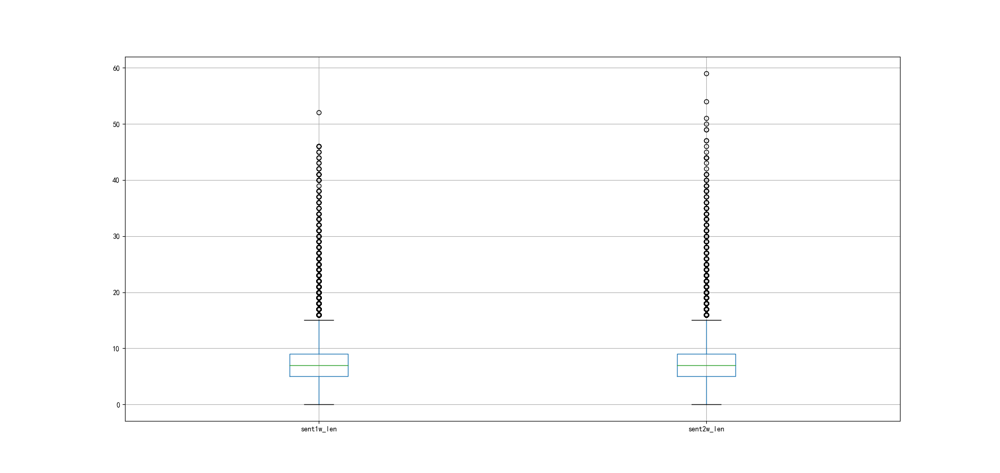
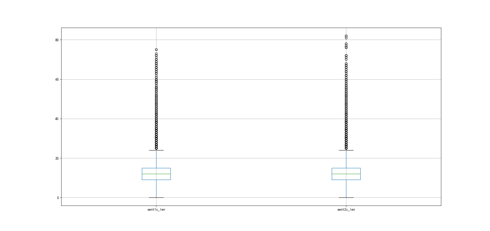    
+ 10折得训练集和验证集  
+ 形成语料库：字级别和词级别  
## 对wiki
+ xml转txt  
+ 繁体转简体  
``opencc -i wiki.zh.txt -o wiki.zh.simp.txt -c t2s.json``
+ 形成语料库：字级别和词级别  

# 词向量
## 使用GloVe训练词向量
+ 基于atec    
min_count=2,embedding_size=25/50/100/200/300,epochs=15,window_size=8,x_max=10  
若min_count=1，训练出来的词向量更易过拟合！
+ 基于wiki    
min_count=5,embedding_size=25/50/100/200/300,epochs=15,window_size=8,x_max=10  
## 使用fastText预训练好的300维词向量
+ 由于内存大小限制，使用.vec文件!  
## 类比关系可视化
### word级
+ glove+atec  
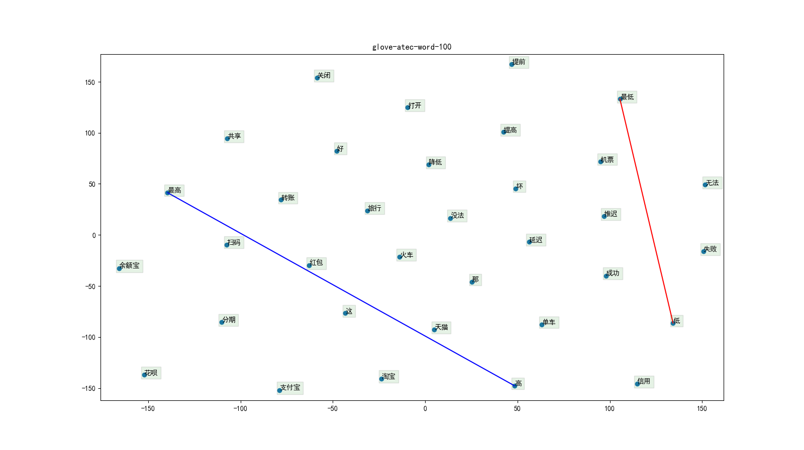
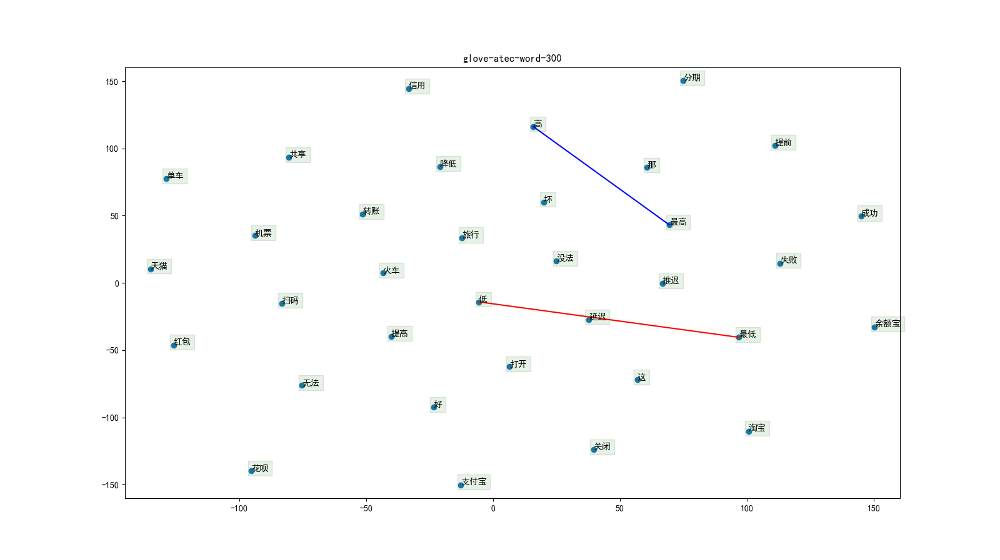
+ glove+wiki  
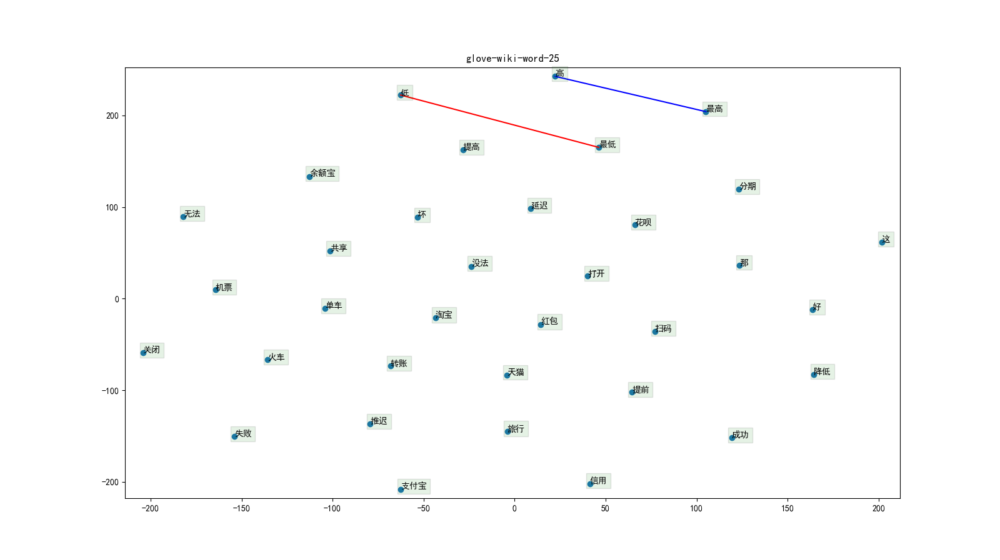
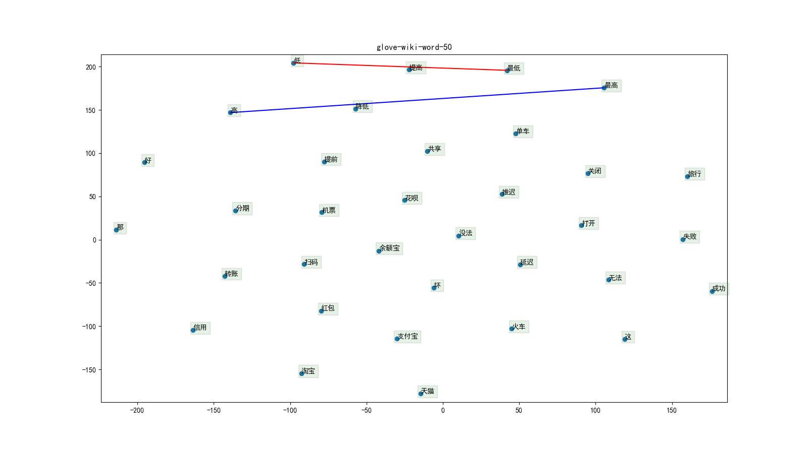
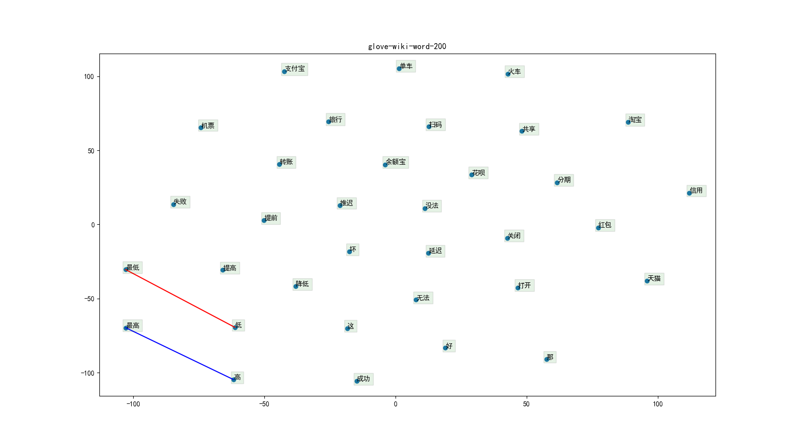
+ fastext  
### char级  
+ glove+atec  
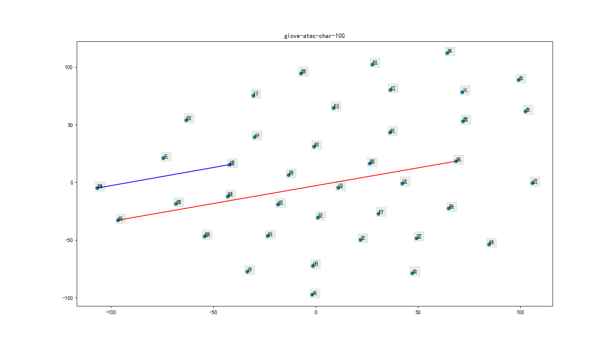
+ glove+wiki  
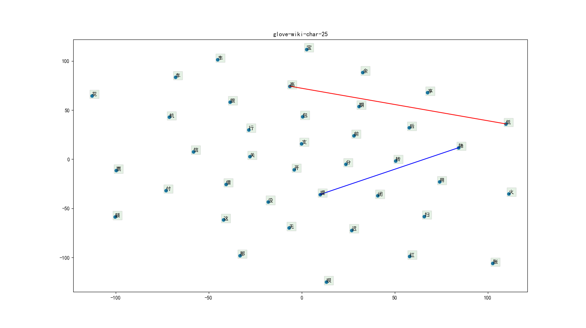
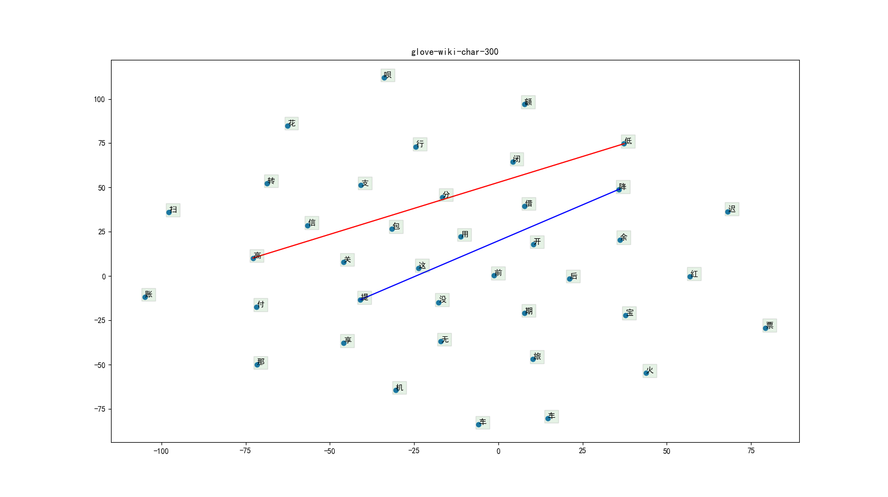
+ fasttext  

## 分析词汇覆盖率
与全局训练数据中min_count=2的vocab进行比较！
### word级
+ glove+atec  

+ glove+wiki  
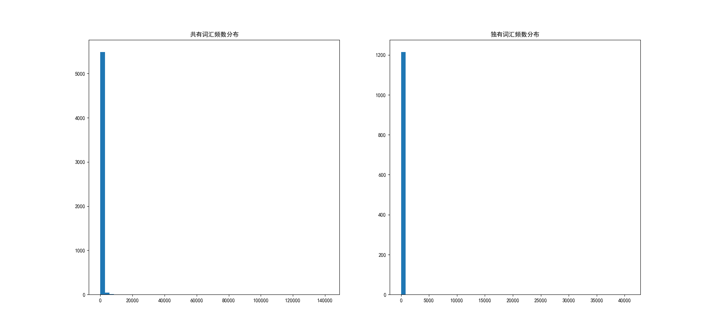
+ fastext  

### char级  
+ glove+atec  
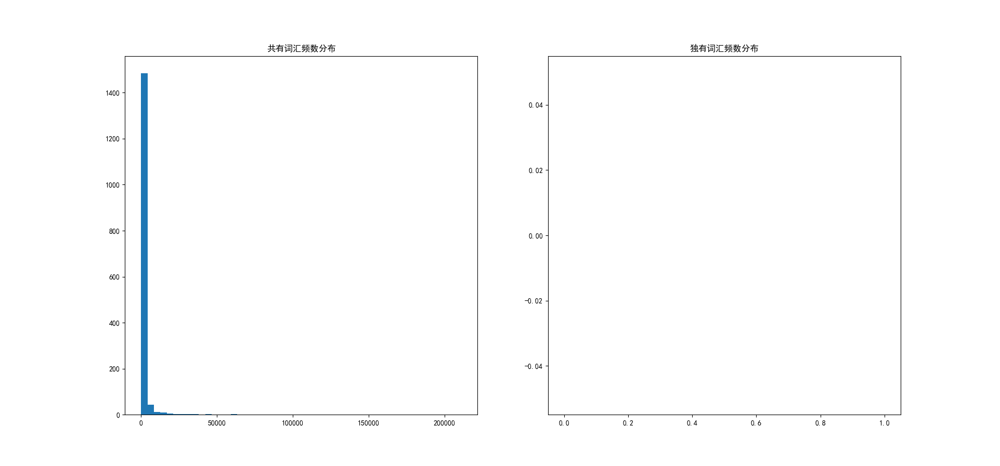
+ glove+wiki  
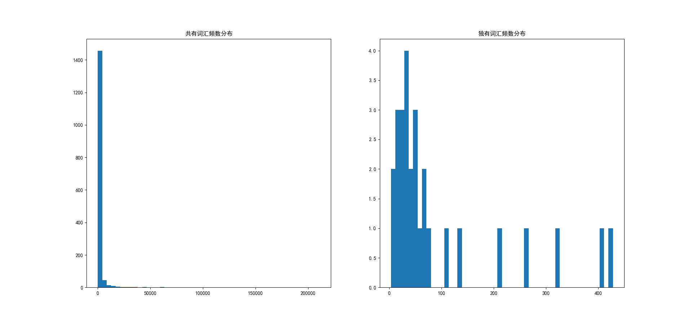
+ fasttext  

## 词向量使用
在训练集中词频数不小于2且在词向量词汇中的词使用对应词向量；
在训练集中词频数不小于2但不在词向量词汇中的词随机初始化，该情况记作编号1；
在训练集中词频数小于2的当作<unk>随机初始化，该情况记作编号2。
static：词向量在模型训练过程中保持不变；nonstatic：词向量在模型训练过程中一起训练。
### A
+ 词级：static+1&2trainable  
+ 字级：static+1&2trainable 
### B
+ 词级：static  
+ 字级：static  
### C
+ 词级：static+1&2trainable  
+ 字级：nonstatic  

# 模型
## SenMatchSen
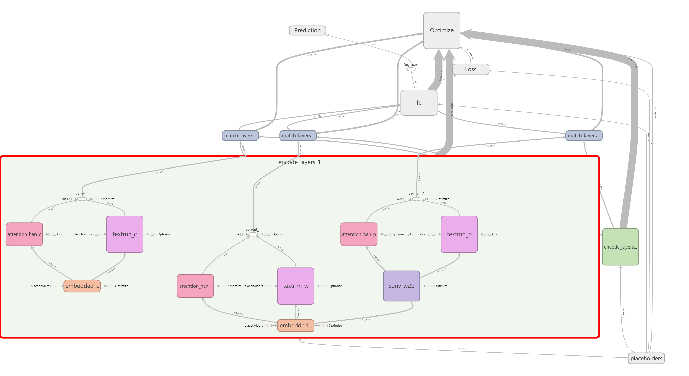
### cross-entropy loss v.s focal loss
+ ce  √  
  
| epoch | threshold | t_f1 | v_f1 | threshold | t_f1 | v_f1 |
| :---: | :---: | :---: | :---: | :---: | :---: | :---: |
| 34 | 0.50 | 0.5928 | 0.5222 | 0.35 | 0.5938 | 0.5353 |
| 57 | 0.50 | 0.6424 | 0.5297 | 0.35 | 0.6552 | 0.5583 |
| 58 | 0.50 | 0.6544 | 0.5282 | 0.35 | 0.6611 | 0.5541 |
| 65 | 0.50 | 0.6667 | 0.5335 | 0.35 | 0.6668 | 0.5553 |
| 76 | 0.50 | 0.6942 | 0.5445 | 0.45 | 0.6888 | 0.5476 | 
+ focal_0.75  

| epoch | threshold | t_f1 | v_f1 | threshold | t_f1 | v_f1 |
| :---: | :---: | :---: | :---: | :---: | :---: | :---: |
| 28 | 0.50 | 0.5601 | 0.5314 | 0.50 | 0.5601 | 0.5314 |
| 38 | 0.50 | 0.5866 | 0.5283 | 0.45 | 0.5789 | 0.5321 |
| 40 | 0.50 | 0.5918 | 0.5426 | 0.50 | 0.5918 | 0.5426 |
| 51 | 0.50 | 0.6133 | 0.5481 | 0.50 | 0.6133 | 0.5481 |
| 74 | 0.50 | 0.6478 | 0.5489 | 0.50 | 0.6478 | 0.5489 |
+ focal_0.5  

| epoch | threshold | t_f1 | v_f1 | threshold | t_f1 | v_f1 |
| :---: | :---: | :---: | :---: | :---: | :---: | :---: |
| 30 | 0.50 | 0.5174 | 0.4675 | 0.40 | 0.5683 | 0.5214 |
| 35 | 0.50 | 0.5549 | 0.4860 | 0.45 | 0.5933 | 0.5290 |
| 44 | 0.50 | 0.5934 | 0.5282 | 0.45 | 0.6023 | 0.5487 |
| 56 | 0.50 | 0.6273 | 0.5359 | 0.50 | 0.6273 | 0.5359 |
| 85 | 0.50 | 0.6881 | 0.5467 | 0.50 | 0.6881 | 0.5467 |
### A v.s B v.s C
+ A  √  
+ B  

| epoch | threshold | t_f1 | v_f1 | threshold | t_f1 | v_f1 |
| :---: | :---: | :---: | :---: | :---: | :---: | :---: |
| 23 | 0.50 | 0.5004 | 0.4635 | 0.35 | 0.5708 | 0.5347 |
| 30 | 0.50 | 0.5695 | 0.5052 | 0.30 | 0.5794 | 0.5293 |
| 48 | 0.50 | 0.6122 | 0.5199 | 0.30 | 0.6327 | 0.5481 |
| 51 | 0.50 | 0.6257 | 0.5320 | 0.35 | 0.6400 | 0.5547 |
| 84 | 0.50 | 0.7112 | 0.5476 | 0.50 | 0.7112 | 0.5476 | 
+ C  

| epoch | threshold | t_f1 | v_f1 | threshold | t_f1 | v_f1 |
| :---: | :---: | :---: | :---: | :---: | :---: | :---: |
| 28 | 0.50 | 0.5826 | 0.5077 | 0.40 | 0.6108 | 0.5416 |
| 48 | 0.50 | 0.6560 | 0.5113 | 0.35 | 0.6660 | 0.5502 |
| 53 | 0.50 | 0.6765 | 0.5227 | 0.35 | 0.6776 | 0.5490 |
| 67 | 0.50 | 0.7218 | 0.5358 | 0.40 | 0.7240 | 0.5492 |
| 73 | 0.50 | 0.7443 | 0.5383 | 0.45 | 0.7393 | 0.5438 | 
## SeqMatchSeq
### 单向 v.s 双向
+ 单向  
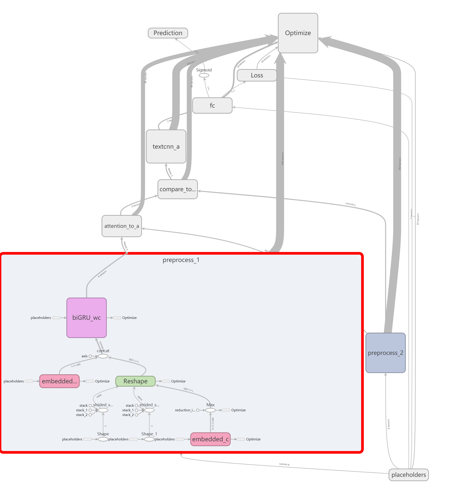

| epoch | threshold | t_f1 | v_f1 | threshold | t_f1 | v_f1 |
| :---: | :---: | :---: | :---: | :---: | :---: | :---: |
| 31 | 0.50 | 0.5561 | 0.4955 | 0.35 | 0.5812 | 0.5290 |
| 43 | 0.50 | 0.6154 | 0.5136 | 0.40 | 0.6303 | 0.5393 |
| 65 | 0.50 | 0.6993 | 0.5254 | 0.45 | 0.6990 | 0.5374 |
+ 双向  √  

| epoch | threshold | t_f1 | v_f1 | threshold | t_f1 | v_f1 |
| :---: | :---: | :---: | :---: | :---: | :---: | :---: |
| 43 | 0.50 | 0.6063 | 0.5185 | 0.35 | 0.6194 | 0.5384 |
| 54 | 0.50 | 0.6509 | 0.5282 | 0.40 | 0.6635 | 0.5418 |
| 58 | 0.50 | 0.6693 | 0.5369 | 0.35 | 0.6692 | 0.5501 |
### 不同的compare方式
+ SUB/MULT+NN  √  

| epoch | threshold | t_f1 | v_f1 | threshold | t_f1 | v_f1 |
| :---: | :---: | :---: | :---: | :---: | :---: | :---: |
| 37 | 0.50 | 0.6121 | 0.5249 | 0.40 | 0.6156 | 0.5411 |
| 58 | 0.50 | 0.6819 | 0.5372 | 0.35 | 0.6790 | 0.5519 |
| 69 | 0.50 | 0.7075 | 0.5401 | 0.45 | 0.7113 | 0.5463 |
+ SUB/MULT/ABS/MAX  

| epoch | threshold | t_f1 | v_f1 | threshold | t_f1 | v_f1 |
| :---: | :---: | :---: | :---: | :---: | :---: | :---: |
| 35 | 0.50 | 0.5761 | 0.5006 | 0.35 | 0.6054 | 0.5311 |
| 46 | 0.50 | 0.6279 | 0.5264 | 0.35 | 0.6362 | 0.5414 |
| 57 | 0.50 | 0.6597 | 0.5342 | 0.35 | 0.6618 | 0.5484 |
## SeqMatchSeq_BiMPM
# Trials
+ 将输出层偏置值初始化为-np.log((1 - pi) / pi)，其中pi为0.01      
开始时，模型分类为正例的概率为0.01，加快了收敛速度，最后结果也略有提升。
+ 使用focal loss  
