# atec_nlp_sim
https://dc.cloud.alipay.com/index#/topic/data?id=3

# 预处理  
## 对atec  
+ 合并训练集  
+ 繁体转简体  
``opencc -i atec_nlp_sim_train_all.csv -o atec_nlp_sim_train_all.simp.csv -c t2s.json``
+ 生成繁体转简体字典  
+ 分词保存  
+ 分析标签分布  
 
+ 分析句长分布  

    
+ 10折得训练集和验证集  
+ 形成语料库：字级别和词级别  
## 对wiki
+ xml转txt  
+ 繁体转简体  
``opencc -i wiki.zh.txt -o wiki.zh.simp.txt -c t2s.json``
+ 形成语料库：字级别和词级别  

# 词向量
## 使用GloVe训练词向量
+ 基于atec    
min_count=2,embedding_size=25/50/100/200/300,epochs=10,window_size=8,x_max=10  
若min_count=1，训练出来的词向量更易过拟合！
+ 基于wiki    
min_count=5,embedding_size=25/50/100/200/300,epochs=15,window_size=8,x_max=10  
## 使用fastText预训练好的300维词向量
+ 由于内存大小限制，使用.vec文件!  
## 类比关系可视化
### word级
+ glove+atec  
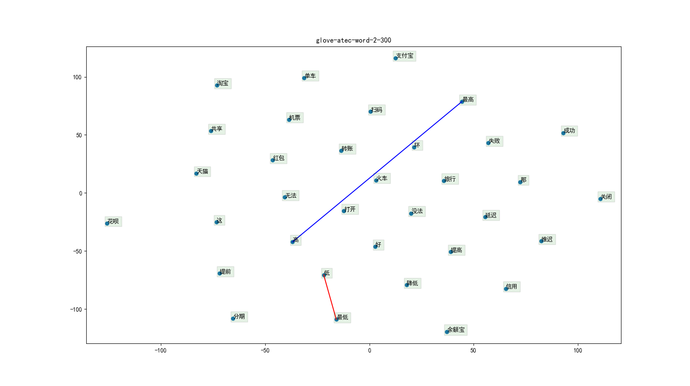
+ glove+wiki  
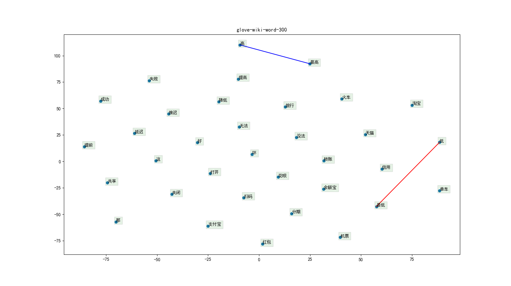
+ fastext  

### char级  
+ glove+atec  
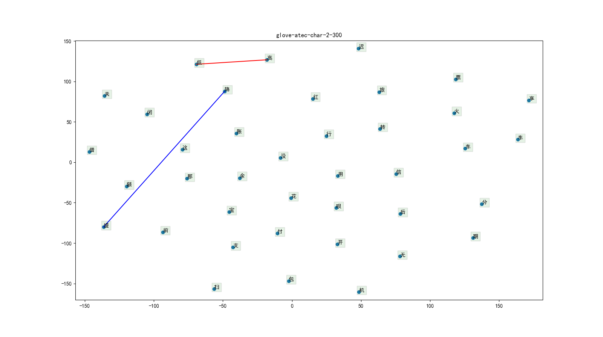
+ glove+wiki  

+ fasttext  

## 分析词汇覆盖率
与全局训练数据中min_count=2的vocab进行比较！
### word级
+ glove+atec  
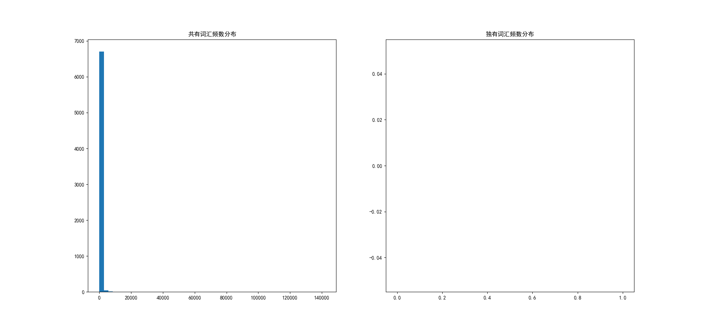
+ glove+wiki  

+ fastext  
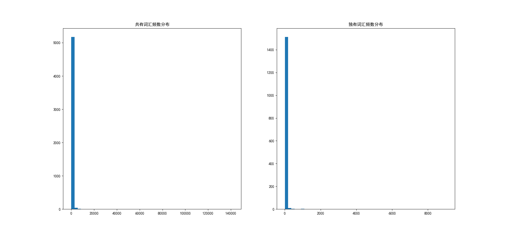
### char级  
+ glove+atec  

+ glove+wiki  

+ fasttext  

## 词向量使用
在训练集中词频数不小于2且在词向量词汇中的词使用对应词向量；
在训练集中词频数不小于2但不在词向量词汇中的词随机初始化，该情况记作编号1；
在训练集中词频数小于2的当作<unk>随机初始化，该情况记作编号2。
static：词向量在模型训练过程中保持不变；nonstatic：词向量在模型训练过程中一起训练。
### A
+ 词级：nonstatic  
+ 字级：nonstatic  
### B
+ 词级：static+1&2trainable  
+ 字级：nonstatic  
### C
+ 词级：static+1&2trainable  
+ 字级：static+1&2trainable 

# 模型
## SenMatchSen

### cross-entropy loss v.s focal loss
Evaluating with file: data/atec/10/train0.csv, local dict: data/atec/10/train0_dict.json...  
Evaluating with file: data/atec/10/valid0.csv, local dict: data/atec/10/train0_dict.json...
+ ce  √  

The total number of trainable variables(embedding matrix excluded): 2490441

| epoch | threshold | t_f1 | v_f1 | threshold | t_f1 | v_f1 |
| :---: | :---: | :---: | :---: | :---: | :---: | :---: |
| 34 | 0.50 | 0.5928 | 0.5222 | 0.35 | 0.5938 | 0.5353 |
| 57 | 0.50 | 0.6424 | 0.5297 | 0.35 | 0.6552 | 0.5583 |
| 58 | 0.50 | 0.6544 | 0.5282 | 0.35 | 0.6611 | 0.5541 |
| 65 | 0.50 | 0.6667 | 0.5335 | 0.35 | 0.6668 | 0.5553 |
| 76 | 0.50 | 0.6942 | 0.5445 | 0.45 | 0.6888 | 0.5476 | 
+ focal_0.75  

The total number of trainable variables(embedding matrix excluded): 2490441

| epoch | threshold | t_f1 | v_f1 | threshold | t_f1 | v_f1 |
| :---: | :---: | :---: | :---: | :---: | :---: | :---: |
| 28 | 0.50 | 0.5601 | 0.5314 | 0.50 | 0.5601 | 0.5314 |
| 38 | 0.50 | 0.5866 | 0.5283 | 0.45 | 0.5789 | 0.5321 |
| 40 | 0.50 | 0.5918 | 0.5426 | 0.50 | 0.5918 | 0.5426 |
| 51 | 0.50 | 0.6133 | 0.5481 | 0.50 | 0.6133 | 0.5481 |
| 74 | 0.50 | 0.6478 | 0.5489 | 0.50 | 0.6478 | 0.5489 |
+ focal_0.5  

The total number of trainable variables(embedding matrix excluded): 2490441

| epoch | threshold | t_f1 | v_f1 | threshold | t_f1 | v_f1 |
| :---: | :---: | :---: | :---: | :---: | :---: | :---: |
| 30 | 0.50 | 0.5174 | 0.4675 | 0.40 | 0.5683 | 0.5214 |
| 35 | 0.50 | 0.5549 | 0.4860 | 0.45 | 0.5933 | 0.5290 |
| 44 | 0.50 | 0.5934 | 0.5282 | 0.45 | 0.6023 | 0.5487 |
| 56 | 0.50 | 0.6273 | 0.5359 | 0.50 | 0.6273 | 0.5359 |
| 85 | 0.50 | 0.6881 | 0.5467 | 0.50 | 0.6881 | 0.5467 |

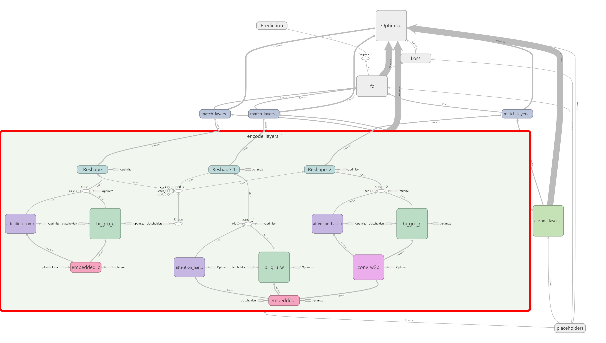
### uniform v.s normal
Evaluating with file: data/atec/10/train0.csv, local dict: data/atec/10/train0_dict.json...  
Evaluating with file: data/atec/10/valid0.csv, local dict: data/atec/10/train0_dict.json...
+ uniform  √  

The total number of trainable variables(embedding matrix excluded): 2490441

| epoch | threshold | t_f1 | v_f1 | threshold | t_f1 | v_f1 |
| :---: | :---: | :---: | :---: | :---: | :---: | :---: |
| 40 | 0.50 | 0.6041 | 0.5297 | 0.40 | 0.6261 | 0.5470 |
| 44 | 0.50 | 0.6270 | 0.5394 | 0.45 | 0.6335 | 0.5493 |
| 53 | 0.50 | 0.6477 | 0.5430 | 0.40 | 0.6551 | 0.5546 |
+ normal  

The total number of trainable variables(embedding matrix excluded): 2490441

| epoch | threshold | t_f1 | v_f1 | threshold | t_f1 | v_f1 |
| :---: | :---: | :---: | :---: | :---: | :---: | :---: |
| 47 | 0.50 | 0.6066 | 0.5266 | 0.35 | 0.6281 | 0.5466 |
| 62 | 0.50 | 0.6429 | 0.5262 | 0.35 | 0.6671 | 0.5530 |
| 68 | 0.50 | 0.6831 | 0.5414 | 0.45 | 0.6814 | 0.5436 |
## SeqMatchSeq
### 单向 v.s 双向
Evaluating with file: data/atec/10/train0.csv, local dict: data/atec/10/train0_dict.json...  
Evaluating with file: data/atec/10/valid0.csv, local dict: data/atec/10/train0_dict.json...
+ 单向  


The total number of trainable variables(embedding matrix excluded): 1842433

| epoch | threshold | t_f1 | v_f1 | threshold | t_f1 | v_f1 |
| :---: | :---: | :---: | :---: | :---: | :---: | :---: |
| 31 | 0.50 | 0.5561 | 0.4955 | 0.35 | 0.5812 | 0.5290 |
| 43 | 0.50 | 0.6154 | 0.5136 | 0.40 | 0.6303 | 0.5393 |
| 65 | 0.50 | 0.6993 | 0.5254 | 0.45 | 0.6990 | 0.5374 |
+ 双向  √  
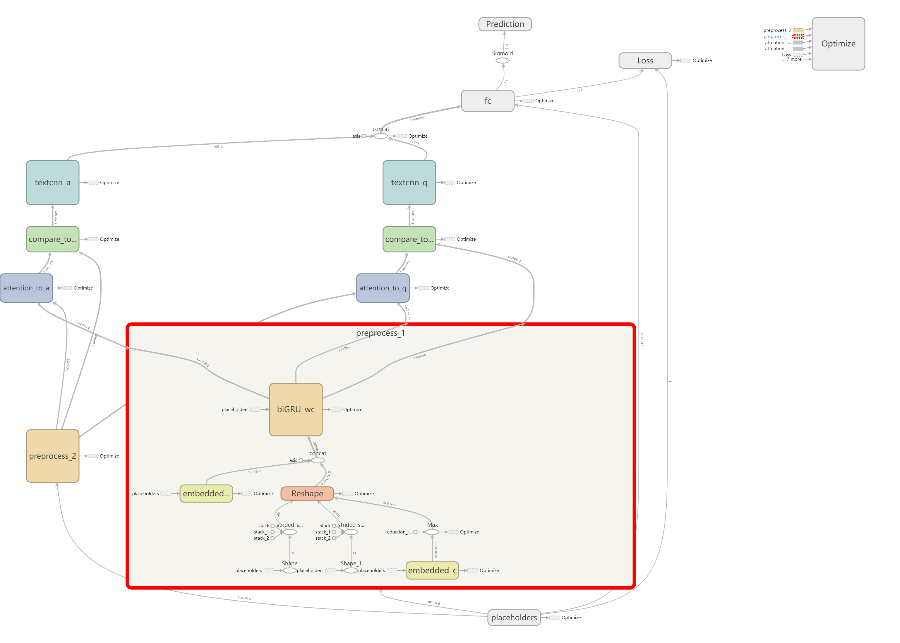

The total number of trainable variables(embedding matrix excluded): 2433537

| epoch | threshold | t_f1 | v_f1 | threshold | t_f1 | v_f1 |
| :---: | :---: | :---: | :---: | :---: | :---: | :---: |
| 43 | 0.50 | 0.6063 | 0.5185 | 0.35 | 0.6194 | 0.5384 |
| 54 | 0.50 | 0.6509 | 0.5282 | 0.40 | 0.6635 | 0.5418 |
| 58 | 0.50 | 0.6693 | 0.5369 | 0.35 | 0.6692 | 0.5501 |
### 是否共用参数
Evaluating with file: data/atec/10/train0.csv, local dict: data/atec/10/train0_dict.json...  
Evaluating with file: data/atec/10/valid0.csv, local dict: data/atec/10/train0_dict.json...
+ 不共用  

The total number of trainable variables(embedding matrix excluded): 962473

| epoch | threshold | t_f1 | v_f1 | threshold | t_f1 | v_f1 |
| :---: | :---: | :---: | :---: | :---: | :---: | :---: |
| 42 | 0.50 | 0.5857 | 0.4903 | 0.30 | 0.6254 | 0.5412 |
| 43 | 0.50 | 0.5910 | 0.4972 | 0.35 | 0.6355 | 0.5460 |
| 44 | 0.50 | 0.6397 | 0.5386 | 0.45 | 0.6380 | 0.5449 |
+ 共用预处理层、联合层参数  √  

The total number of trainable variables(embedding matrix excluded): 563669

| epoch | threshold | t_f1 | v_f1 | threshold | t_f1 | v_f1 |
| :---: | :---: | :---: | :---: | :---: | :---: | :---: |
| 18 | 0.50 | 0.6035 | 0.5300 | 0.35 | 0.6223 | 0.5503 |
| 28 | 0.50 | 0.6691 | 0.5409 | 0.45 | 0.6731 | 0.5560 |
| 29 | 0.50 | 0.6772 | 0.5523 | 0.40 | 0.6707 | 0.5572 |
## SeqMatchSeq_BiMPM
### 是否共用参数
Evaluating with file: data/atec/10/train0.csv, local dict: data/atec/10/train0_dict.json...  
Evaluating with file: data/atec/10/valid0.csv, local dict: data/atec/10/train0_dict.json...
+ 不共用  
+ 共用预处理层、联合层参数  √    

The total number of trainable variables(embedding matrix excluded): 407381
  
| epoch | threshold | t_f1 | v_f1 | threshold | t_f1 | v_f1 |
| :---: | :---: | :---: | :---: | :---: | :---: | :---: |
| 7 | 0.50 | 0.5742 | 0.5269 | 0.45 | 0.5764 | 0.5294 |
| 11 | 0.50 | 0.5982 | 0.5317 | 0.45 | 0.6087 | 0.5482 |
| 16 | 0.50 | 0.6440 | 0.5528 | 0.45 | 0.6467 | 0.5582 |

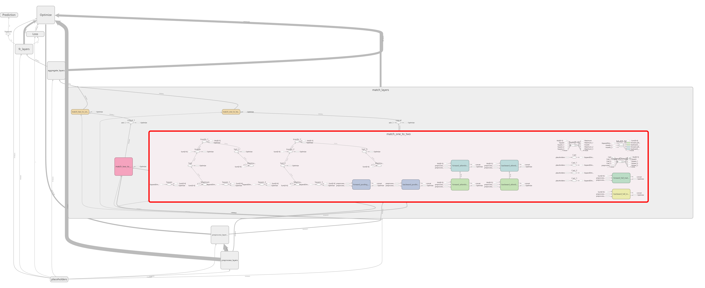
### 其他
Evaluating with file: data/atec/10/train0.csv, local dict: data/atec/10/train0-2-2.json...  
Evaluating with file: data/atec/10/valid0.csv, local dict: data/atec/10/train0-2-2.json...
+ modeC=10+dropout0.1    

The total number of trainable variables(embedding matrix excluded): 407381
  
| epoch | threshold | t_f1 | v_f1 | threshold | t_f1 | v_f1 |
| :---: | :---: | :---: | :---: | :---: | :---: | :---: |
| 18 | 0.50 | 0.6231 | 0.5556 | 0.40 | 0.6111 | 0.5575 |
| 24 | 0.50 | 0.6517 | 0.5644 | 0.45 | 0.6502 | 0.5665 |
| 27 | 0.50 | 0.6662 | 0.5653 | 0.50 | 0.6662 | 0.5653 |
# Trials
+ 将输出层偏置值初始化为-np.log((1 - pi) / pi)，其中pi为0.01      
开始时，模型分类为正例的概率为0.01，加快了收敛速度，最后结果也略有提升。
+ 使用focal loss 
***  
增大最小频数：2,2->4,4
***
# 词向量
## 使用GloVe训练词向量
+ 基于atec    
min_count=4,embedding_size=25/50/100/200/300,epochs=10,window_size=8,x_max=10  
## 类比关系可视化
### word级
+ glove+atec  
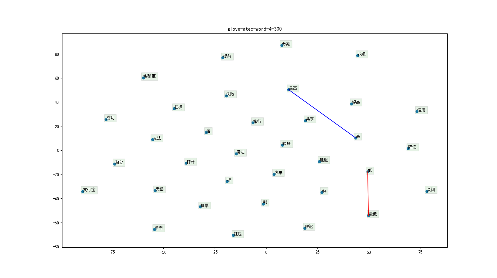
### char级  
+ glove+atec  
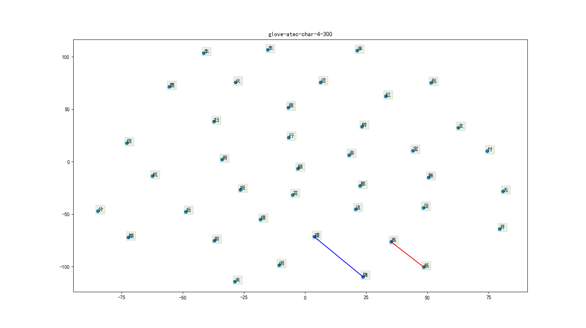
## 分析词汇覆盖率
与全局训练数据中min_count=4的vocab进行比较！
### word级
+ glove+atec  
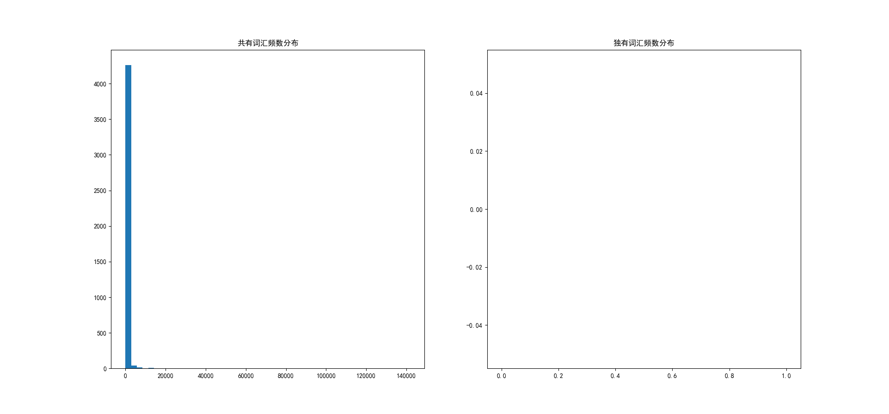
+ glove+wiki  
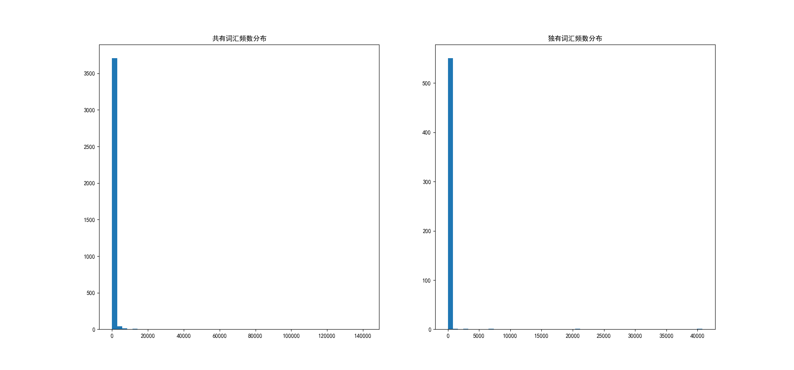
+ fastext  
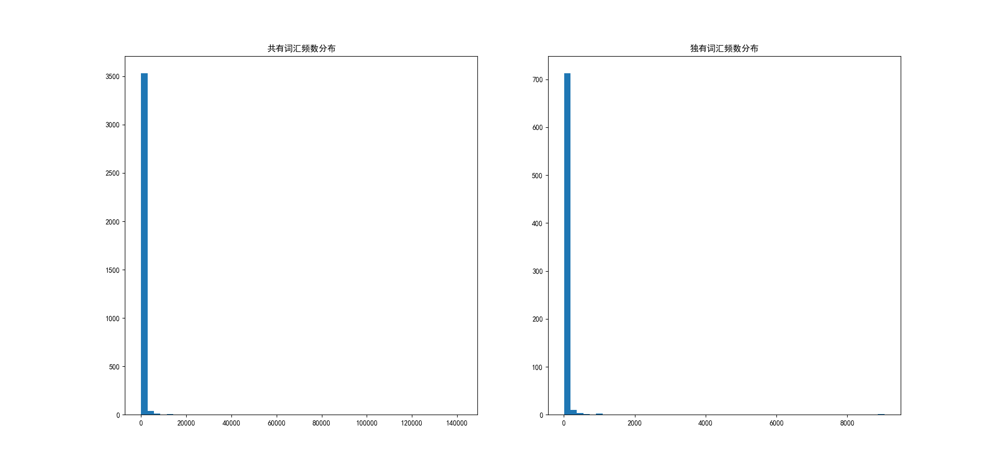
### char级  
+ glove+atec  
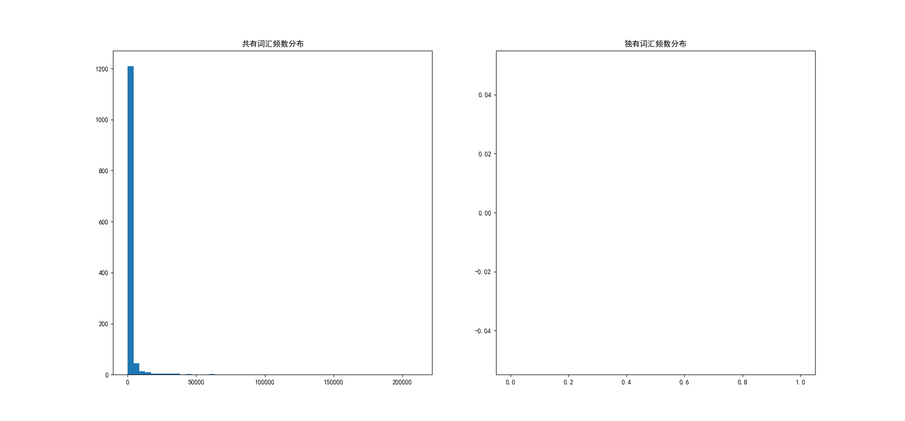
+ glove+wiki  
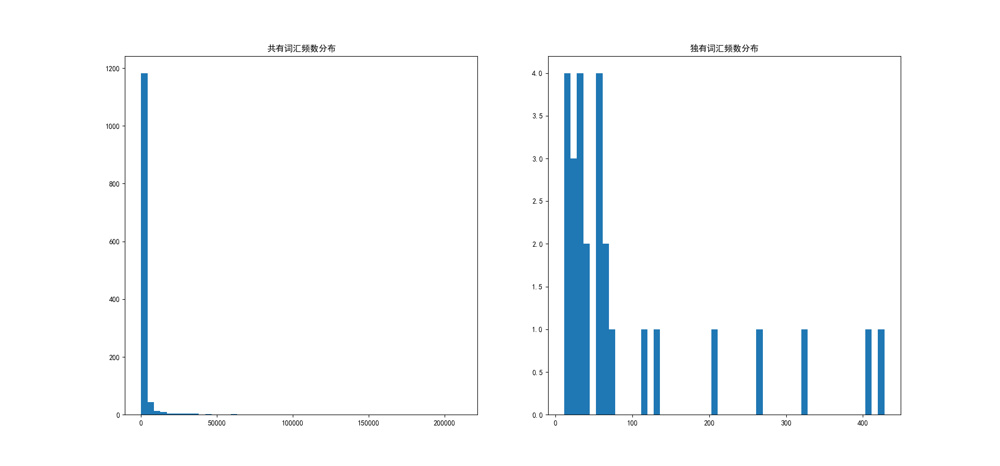
+ fasttext  
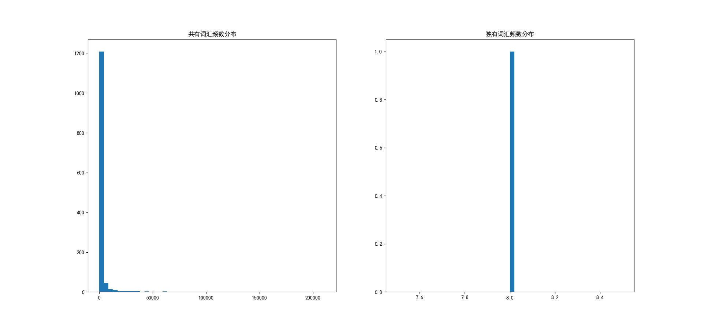
## 词向量使用
在训练集中词频数不小于4且在词向量词汇中的词使用对应词向量；
在训练集中词频数不小于4但不在词向量词汇中的词随机初始化，该情况记作编号1；
在训练集中词频数小于4的当作<unk>随机初始化，该情况记作编号2。
static：词向量在模型训练过程中保持不变；nonstatic：词向量在模型训练过程中一起训练。
### A
+ 词级：nonstatic  
+ 字级：nonstatic  
### B
+ 词级：static+1&2trainable  
+ 字级：nonstatic  
### C
+ 词级：static+1&2trainable  
+ 字级：static+1&2trainable  


# NLNN-ECTC
## 音素级标注
### 理论部分
给定一个训练样本，记其对应的特征向量序列为${x}$，对应的音素级标注序列为${y}$。记${x}$的长度即帧数为${T}$，整个训练集记作${S}$。输出层softmax的第k个输出单元对应${\phi}$即“blank”，第0个到第k-1个单元对应着音素集中的k个音素。
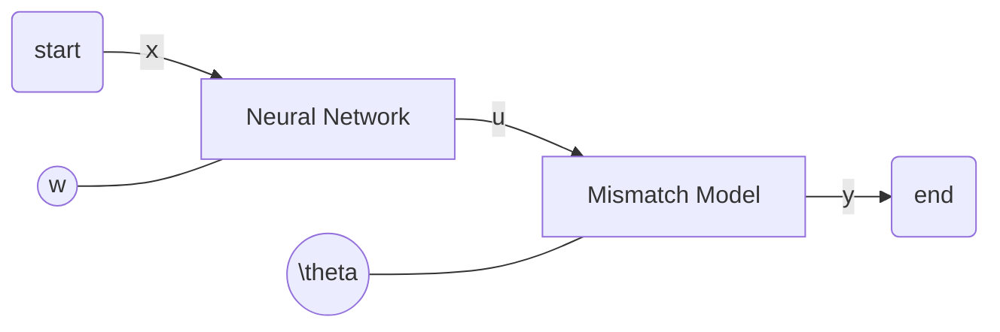
$${\begin{equation}\begin{aligned}
L(w,\theta)&=\sum\limits_{(x,y)\in{S}}logP(y|x;w,\theta)\\
&=\sum\limits_{(x,y)\in{S}}log\sum\limits_{u}P(u|x;w)P(y|u;\theta)\\
&=\sum\limits_{(x,y)\in{S}}log\sum\limits_{u}A(u)\frac{P(u|x;w)P(y|u;\theta)}{A(u)}\\
&\geq\sum\limits_{(x,y)\in{S}}\sum\limits_{u}A(u)log\frac{P(u|x;w)P(y|u;\theta)}{A(u)}\\
\end{aligned}\end{equation}}$$
当且仅当
$${\sum\limits_{u}P(u|x;w_0)P(y|u;\theta_0)==\frac{P(u|x;w_0)P(y|u;\theta_0)}{A(u)}}$$
时取“＝”号，即
$${\begin{equation}\begin{aligned}
A(u)&=\frac{P(u|x;w_0)P(y|u;\theta_0)}{\sum\limits_{u}P(u|x;w_0)P(y|u;\theta_0)}\\
&=P(u|x,y;w_0,\theta_0)
\end{aligned}\end{equation}}$$
记作${C_{xyu}}$。此时最大化${L(w,\theta)}$等价于最大化
$${\begin{equation}\begin{aligned}
\sum\limits_{(x,y)\in{S}}\sum\limits_{u}C_{xyu}logP(u|x;w)P(y|u;\theta)&=\sum\limits_{(x,y)\in{S}}\sum\limits_{u}C_{xyu}logP(u|x;w)\\&+\sum\limits_{(x,y)\in{S}}\sum\limits_{u}C_{xyu}logP(y|u;\theta)
\end{aligned}\end{equation}}$$
+ 关于${\sum\limits_{(x,y)\in{S}}\sum\limits_{u}C_{xyu}logP(y|u;\theta)}$，
令${\theta(i,j)}$，i取0...k-1，j取0...k+1，
$${\begin{equation}
\theta(i,j)表示\left\{\begin{array}{rcl}替换（读错）&&{i取0...k-1，j取0...k-1}\\插入（多读）&&{i取0...k-1，j取k}\\删除（漏读）&&{i取0...k-1，j取k+1}\end{array}\right.
\end{equation}}$$
约定${\sum\limits_{j=0}^{k+1}\theta(i,j)=1}$，${\theta(i,j)\geq0}$。
给定2个音素序列$u$和$y$，可以求得二者之间的最短编辑距离。如果将序列$u$从上到下绘制在左侧，序列$y$从左到右绘制在上方，这个最短编辑距离可以被表示成图中的一条路径。路径中，斜方向的移动表示替换，水平方向的移动表示删除，竖直方向的移动表示插入。设将序列$u$变为序列${y}$的总操作数为${e(u,y)}$，第$m$个操作对应着概率$\theta(i_m,j_m)$，则定义将序列$u$变为序列${y}$的概率
$${P(y|u;\theta)=\prod\limits_{m=1}^{e(u,y)}\theta(i_m,j_m)}$$
令${U=\{u:P(u|x;w)\gt\delta\}}$，其中$\delta$是一个绝对值较小的正实数，则
$${P(y|x;w,\theta)\approx\sum\limits_{u\in{U}}P(u|x;w)P(y|u;\theta)}$$
因此，最大化
$${\begin{equation}\begin{aligned}
\sum\limits_{(x,y)\in{S}}\sum\limits_{u}C_{xyu}logP(y|u;\theta)&＝\sum\limits_{(x,y)\in{S}}\sum\limits_{u}C_{xyu}log\prod\limits_{m=1}^{e(u,y)}\theta(i_m,j_m)\\
&=\sum\limits_{(x,y)\in{S}}\sum\limits_{u}C_{xyu}\sum\limits_{m=1}^{e(u,y)}log\theta(i_m,j_m)
\end{aligned}\end{equation}}$$记作${B_\theta}$，考虑到${\sum\limits_{j=0}^{k+1}\theta(i,j)=1}$，结合拉格朗日乘子法计算
${\frac{\partial B_\theta}{\partial \theta(i,j)}}$，得
$${\theta(i,j)=\frac{\sum\limits_{(x,y)\in S}\sum\limits_{u}C_{xyu}e_{ij}}{\sum\limits_{(x,y)\in S}\sum\limits_{u}C_{xyu}e_{i}}}$$
其中，${e_{ij}}$表示序列$u$到序列${y}$转换中涉及${i\rightarrow j}$的操作次数，${e_{i}}$表示序列$u$到序列${y}$转换中${i\rightarrow}$的操作次数。

**问题：相同的编辑距离下编辑方式有多种，如何抉择？**
```
ref = [1, 2, 3, 4]
hyp = [1, 2, 4, 5, 6]
```

+ 关于${\sum\limits_{(x,y)\in{S}}\sum\limits_{u}C_{xyu}logP(u|x;w)}$，
变为原始CTC loss的加权和。
---
### 算法流程

+ 初始化得${w_0}$、${\theta_0}$
 + 使用${(x,y)\in S}$训练神经网络，不考虑不匹配模型，得到的$w_0$作为初始值来初始化神经网络参数$w$
 + 根据当前网络参数进行解码得到U，计算${\theta_0}$作为${\theta}$初始值
$${\theta_0(i,j)=\frac{\sum\limits_{(x,y)\in S}\sum\limits_{u\in U}P(u|x;w_0)e_{ij}}{\sum\limits_{(x,y)\in S}\sum\limits_{u\in U}P(u|x;w_0)e_{i}}}$$
+ E步计算${C_{xyu}}$
$${C_{xyu}=P(u|x,y;w_0,\theta_0)}=\frac{P(u|x;w_0)P(y|u;\theta_0)}{\sum\limits_{u}P(u|x;w_0)P(y|u;\theta_0)}$$
+ M步更新${w}$、${\theta}$
---
### 实验部分
#### 数据预处理
+ 选择train、dev、test集
+ 提取mfcc特征、特征0均值1方差化、61标签转换为39标签，形成trainval集和test集
+ 划分trainval集形成train集和valid集
+ 对trainval集进行标签随机加噪

#### 数据使用
+ 使用bucket+padding，使用序列最后1个时刻的特征向量进行特征序列padding，使用"blank"进行标签序列padding
+ 标签使用稀疏表示

#### 模型搭建
##### NN-CTC
+ 使用PER即Phoneme Error Rate，计算公式:
$${E(h,S)=\frac{1}{Y}\sum\limits_{(x,y)\in{S}}EditDistance(h(x),y)}，$$
其中，${Y}$为所有标签序列的长度和。

##### NLNN-ECTC


